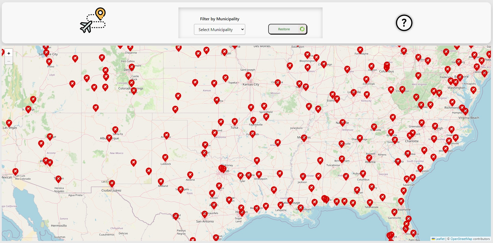
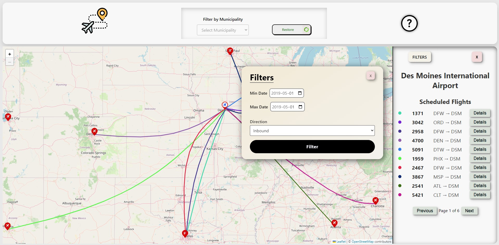
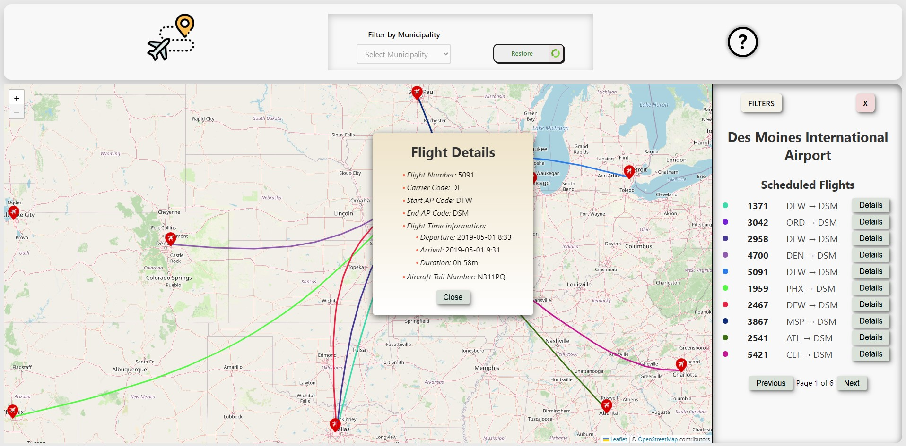

# Air Traffic Informer

## Description

Full Stack MERN Application

The Air Traffic Informer Application is a web-based interface that allows users to view historical flight information on a map. Users can filter flights by date, direction (inbound or outbound), and airport, and can view details about each flight, such as flight number, carrier code, departure and arrival times, and aircraft information. The application provides an interactive map to view airports and flight routes and supports paginated flight listings and filtering options.

## Project Goal

The goal of this project is to create an intuitive and interactive application for tracking flights across various airports. By using a MongoDB database, Express.js server, and a Leaflet map interface on the client side, this app allows users to visually explore flight routes and details, enhancing their experience in understanding aviation data.


## UI Screenshots

### Main Map View


### Flight List View


### Flight Details View



## Setup Instructions

To run this project locally, follow these steps:

### 1. Clone the Repository

```
git clone <repository-url>
cd <repository-directory>
```

### 2. Set Up Environment Variables

Create a .env file in the root of the project with the following content:

ATLAS_URI= your-mongodb-atlas-uri 

### 3. Install Dependencies

From the root of the project:

````
npm run build
````

### 4. Start the Server

From the root of the project:

````
npm start
````

### 5. Access the Application

After starting the server, open your browser and navigate to the link shown in the terminal: 
- http://localhost:3001

## Deployed Locations
- Render : https://air-traffic-informer.onrender.com/

### How to Re-deploy

#### Render:

- Select correct branch and allow page to self-redeploy

#### AWS:
- Download Artifact File from Staging or Main

- SCP the file into the AWS instance
````
scp -r -i Pem_File.pem File_Name.tar.gz bitnami@Instance_IP:~ 
````

- Unzip the File in the AWS instance - 
```` 
tar -xvzf File_name.tar.gz
````

- Stop the other running website instane
````
forever stopall
````

- Copy the .env file from the older instance into the new instance
````
cp Old_Webiste/server/.env New_Website/server/
````

- cd into the server folder
````
cd New_Website/server/
````

- Run the forever command
````
NODE_ENV=production PORT=3001 forever start bin/www.mjs
````

- If it fails to run, check if its running and the logs
````
forever list
cd ~/.forever
cat Asociated_Log_File.log
````

## Attributions
### Data Sources:

- Flight data: [MongoDB collections](https://aviationstack.com/documentation)
- Airport data: [API from OpenAirports](https://ourairports.com/airports.html)

### Libraries:

- Leaflet for interactive maps
- React-Leaflet for Leaflet integration with React
- Express.js for server-side routing and middleware
- MongoDB for database management
- Swagger for API documentation

### Icons:

- [Flight icons created by Freepik - Flaticon](https://www.flaticon.com/free-icons/airport) - Logo
- [Question icons created by Freepik - Flaticon](https://www.flaticon.com/free-icons/question)- Info button
- [Submit button for filter - Uiverse](https://uiverse.io/BHARGAVPATEL1244/great-catfish-18) - Submit filter Button
- [Refresh icons created by srip - Flaticon](https://www.flaticon.com/free-icons/refresh) - Refresh airports icon
- [Airport icons created by riajulislam - Flaticon](https://www.flaticon.com/free-icons/airport) - Airport icon on map
